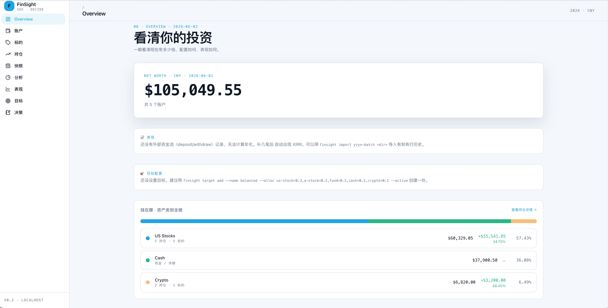
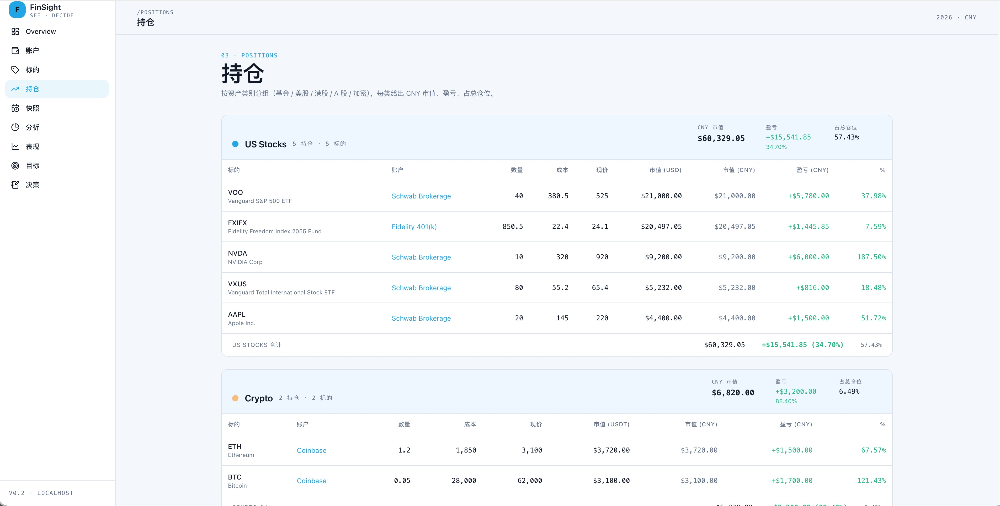
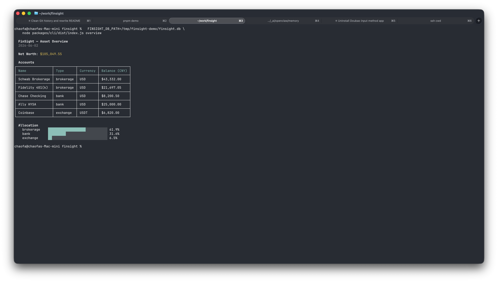
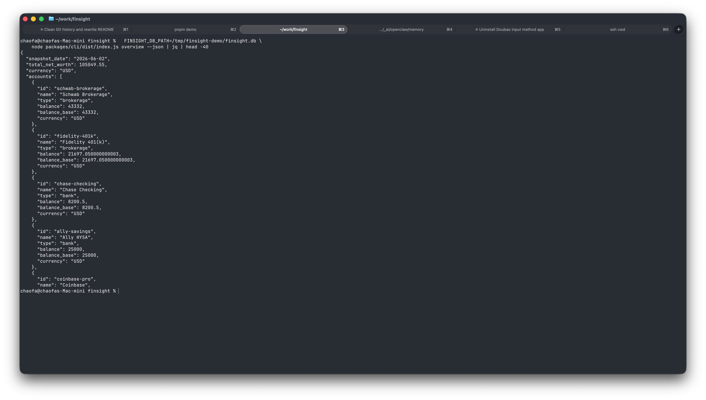
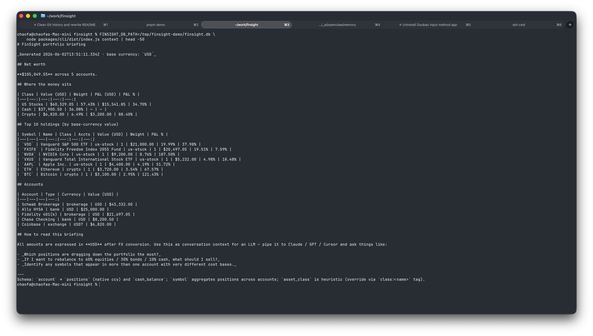

<div align="center">

# FinSight

**看清你的钱在哪里，再做下一步决策。**

一个跑在你笔记本上、对 AI 工具友好的个人投资追踪工具。
数据存在你能直接打开和编辑的文本文件里。

[](https://github.com/ApeCodeAI/finsight/actions/workflows/ci.yml)
[](./LICENSE)
[](./tsconfig.base.json)
[](./package.json)
[](./pnpm-workspace.yaml)
[](#-项目状态)
[](./CONTRIBUTING.md)
[](https://bytepass.ai)

Built by **[ApeCode.ai](https://apecode.ai)** · Sponsored by **[BytePass.ai](https://bytepass.ai)**

[English README →](./README.md)

<br />



<sub><i>FinSight Web Dashboard —— 多币种净资产、资产配置、趋势图，全部在 <code>localhost:3210</code></i></sub>

</div>

---

## 为什么要做 FinSight

大多数投资管理工具都要你先注册、把数据交给它们的云、然后再使用。等你想问大模型「我该不该再平衡？」的时候，只能截图复制粘贴。

FinSight 走另一条路：

- 🗂 **你的文件就是真相。** 持仓存在你硬盘上的纯文本里（YAML，人能读懂），用 `git` 备份，任何编辑器都能改，任何机器都能打开。App 里那个数据库只是工作副本。
- 🌍 **基准币你说了算。** USD / CNY / JPY / EUR，挑一个，其他币种自动换算到这个。没有地区锁定。
- 🤖 **AI 是一等用户。** 每个命令都能输出结构化 JSON；仓库里有一个 markdown 文件（叫 [skill](./skills/finsight/SKILL.md)），任何 AI 助手（Claude / Cursor / Codex / ChatGPT）读完就知道怎么帮你操作。
- 🔒 **数据不出本机。** 无云端、无注册、无埋点。Dashboard 默认只跑在 `localhost`。

> 一个好的投资追踪工具，应该先是一个文件格式，然后是命令行，最后才是 Dashboard。

## ⚡ 60 秒上手（demo）

```bash
git clone https://github.com/ApeCodeAI/finsight && cd finsight
pnpm install
pnpm demo            # ← USD/英文 demo + dashboard 在 localhost:3210
pnpm demo zh         # ← CNY/中文 demo（A股基金 / 港股 / 美股 / 加密）
```

Demo 会在 `/tmp/finsight-demo` 创建一个一次性沙箱，加载样例组合，
自动打开 dashboard。Ctrl+C 退出后沙箱自动清掉，完全不影响你真实的
`~/.finsight/` 配置。

## 🔧 正式安装

```bash
# 1. clone & build
git clone https://github.com/ApeCodeAI/finsight && cd finsight
pnpm install && pnpm -r build

# 2. 把 finsight 命令放到 PATH 里（软链到 ~/.local/bin）
ln -sf "$(pwd)/packages/cli/dist/index.js" ~/.local/bin/finsight
chmod +x packages/cli/dist/index.js

# 3. 首次配置
finsight init        # 问你基准币、地区、文件存哪里

# 4. 用起来
finsight overview
finsight web         # http://localhost:3210
```

## 🔭 同一份数据，三个看法

同一份组合，三种不同的看法 —— 哪个场景顺手用哪个。

### 1. Web Dashboard —— 给人眼看



<sub><i>持仓页 —— 所有账户的同一标的聚合在一起，成本、现价、盈亏、占比一目了然</i></sub>

### 2. CLI 表格 —— 在终端里一口气看完



```bash
$ finsight overview
# 净资产 + 按类别分布，全部按你的基准币换算
```

### 3. AI 能直接读的 JSON —— 给隔壁 tab 的 agent 用



```bash
$ finsight overview --json | jq
# 同样的数据，结构化。输出格式有文档、有稳定承诺。
# 见 docs/json-stability.md
```

> 同一组数字，三个窗口。Web、终端、JSON 看到的是完全相同的内容 ——
> 你永远不用在它们之间截图或复制粘贴。

## ✨ 和别的工具的区别

| 维度 | 大多数工具 | FinSight |
|---|---|---|
| 数据存哪儿 | 它的云 | 你的笔记本上，纯文本文件 |
| 真相在谁手里 | 它的数据库 | 你的文件；App 的 DB 只是副本 |
| AI 怎么用 | 也许给你一个聊天框 | 有文档的 JSON 输出，任何 AI 都能读 |
| 基准币 | 写死 | `finsight config set base-currency JPY` |
| Schema 变化 | 它的迁移脚本 | 你自己改文件 |
| 备份 | 绑在它身上 | `git commit` 你的文件夹 |
| 账户模型 | 必须注册 | 没有 —— 以你的身份在你机器上跑 |

## 🎯 在做什么 / 不在做什么

FinSight 是 **portfolio tracker**（投资追踪工具）—— 回答「我有什么、值多少钱」。它不是记账 App。

它做的：

- **多账户、多币种持仓** —— 全部换算到你选定的一个基准币
- **每日净资产快照 + 趋势** —— 看资产怎么随时间变化
- **资产配置** —— 钱怎么分散在股 / 债 / 现金 / 加密里，可以设目标，看偏离
- **投资日志** —— 每次买入记下为什么买、目标价、止损价；价格触发时工具会提醒你
- **和券商对账** —— 把券商显示的总数贴进来，工具告诉你哪里对不上
- **年化收益（XIRR）** —— 按账户和整体算的那种考虑你实际何时投钱、取钱的年化（不是简单的涨跌幅）
- **AI 简报** —— `finsight context` 输出一份 Markdown，复制粘到 ChatGPT / Claude 里问意见

它不做的：

不做收入、支出、预算追踪 —— 那是另一个产品。要做预算，可以和这些工具配合：

- [**Beancount**](https://beancount.github.io/) —— 纯文本复式记账
- [**Actual**](https://actualbudget.org/) —— 本地优先的信封预算（开源）
- [**YNAB**](https://www.ynab.com/) / [**Lunch Money**](https://lunchmoney.app/) —— 商业化，体验好

FinSight 用的是纯文本文件，两边并行用没问题。

## 🤖 让 AI agent 帮你操作

仓库里有一个 markdown 文件 —— [`skills/finsight/SKILL.md`](./skills/finsight/SKILL.md) —— 是写给 AI 助手看的「使用手册」。不是 API 接入，也不是插件，就是一份说明文档，像新同事入职指南那种。

AI 读完之后，你就可以说：

```text
"读 skills/finsight/SKILL.md，然后帮我装 finsight，从今天开始追踪我的组合。
 我每月 15 号工资到招商银行 —— 自动给我记 deposit。"
```

日常「我组合现在啥样、下一步该干啥」的姿势 —— 把简报喂进去：



```bash
finsight context | pbcopy    # Markdown 简报 → 剪贴板 → 粘进 ChatGPT/Claude
finsight context --json      # 结构化数据，给自主 agent 用
```

不需要装 MCP server，不需要 OAuth。Skill 对任何能读文本的工具都好用。
[`skills/README.md`](./skills/README.md) 写了怎么把它接到你常用的 AI 工具里。

## 🏗 怎么搭起来的

```
┌─────────────────┐     ┌──────────────┐     ┌──────────────┐
│  finsight CLI   │     │  Web (Vite)  │     │  AI agent    │
└────────┬────────┘     └──────┬───────┘     └──────┬───────┘
         │                     │                     │
         └─────────┬───────────┴─────────┬───────────┘
                   │                     │
              ┌────▼─────┐         ┌─────▼─────┐
              │ Hono API │ ◄─────► │  SQLite   │   ← 工作副本
              └────┬─────┘         └─────▲─────┘
                   │                     │
                   │              finsight ledger sync (每日)
                   │                     ▼
                   │             ┌───────────────┐
                   └────────────►│  你的文件夹   │   ← 真相（git 追踪）
                                 │  accounts.yaml│
                                 │  fx-rates.yaml│
                                 │  transactions │
                                 │  snapshots/   │
                                 │  decisions/   │
                                 └───────────────┘
```

细节：[`docs/data-sources.md`](./docs/data-sources.md) 讲价格和汇率源
怎么工作，[`docs/json-stability.md`](./docs/json-stability.md) 讲 AI
工具能依赖 JSON 输出的哪些部分。

## ⚙️ 配置

```bash
finsight config set base-currency CNY       # USD / CNY / JPY / EUR / ...
finsight config set display-locale zh-CN    # 任意标准 locale
finsight config set labels-language zh      # en / zh
finsight config set ledger-dir ~/notes/finance/ledger
```

配置存在 `~/.finsight/config.json`，`FINSIGHT_DB_PATH` 环境变量可以
改 SQLite 工作副本的位置。

### 🔒 关于安全

Web Dashboard **没有登录界面** —— 设计上就是只跑在 `localhost`。
不要把它暴露到公网，任何能访问端口的人都能看到你完整的资产。

如果一定要远程访问，套一层带鉴权的反代（Caddy + basic auth、
Tailscale serve、Cloudflare Access 都行）。原生鉴权暂时不在规划内 ——
FinSight 是个人工具。完整安全策略见 [SECURITY.md](./SECURITY.md)。

## 📖 CLI 速查

**初始化和配置**
```bash
finsight init                     # 交互式首次配置
finsight config list              # 看当前配置
finsight config set base-currency CNY
```

**看你的组合**
```bash
finsight overview                 # 净资产总览 + 按类别分布
finsight account list / show
finsight symbol list              # 按 ticker 聚合（跨账户）
finsight symbol show PDD          # PDD 在你所有账户里的持仓
finsight position list
finsight web                      # dashboard
```

**记录交易和余额**
```bash
finsight trade buy <acc> PDD 100              # 自动抓今天的收盘价
finsight trade buy <acc> 110020 --amount 1000 # 基金：按金额买，--amount 必填
finsight trade buy <acc> PDD 100 --price 82.5 # 指定成本价
finsight trade buy <acc> PDD 100 --date 2025-11-15
finsight trade list --needs-review            # 价格是自动猜的，回头确认一下
finsight transaction confirm <id> --price 84  # 把猜的价格替换成真实值
finsight balance update <acc> 250000
```

**刷新价格**
```bash
finsight quote update                         # 全量：所有持仓 + 汇率
finsight quote update --symbols PDD,MSFT      # 部分
finsight quote update --dry-run               # 预览不写入
```

**对账与备份**
```bash
finsight reconcile <acc>                      # 和券商 App 显示的对比
finsight reconcile log                        # 历史对账记录
finsight ledger sync                          # 把今天的 DB 镜像存到你文件夹里
finsight ledger verify                        # 检查 DB 和文件是否一致
finsight ledger restore --yes                 # 灾难恢复：从文件重建 DB
```

**把组合喂给 LLM**
```bash
finsight context | pbcopy                     # Markdown 简报 → 剪贴板
finsight context --json                       # 结构化 payload
```

所有读命令都支持 `--json`。退出码语义稳定：

| 码 | 含义 |
|---|---|
| 0 | OK |
| 1 | USER_ERROR —— 参数错 |
| 2 | DATA_CONFLICT —— 违反规则（如卖出超过持仓） |
| 3 | NOT_FOUND —— 名字/id 不存在 |
| 4 | INTERNAL —— 未捕获异常 |

`--json` 模式下，错误以 `{"error","code","hint?"}` 写 stderr，stdout 永远是数据或空。

## 🗂 仓库结构

```
finsight/
├── packages/              # 实际代码（pnpm workspaces）
│   ├── core/              #   共享逻辑、DB、文件读写、翻译 —— 没有 UI
│   ├── cli/               #   finsight 命令
│   ├── web/               #   Vite + React 19 + Tailwind v4 + Hono API
│   ├── connector-yfinance #   Yahoo Finance（美股 / 港股 / 加密 / 汇率）
│   ├── connector-tiantian #   天天基金 —— 中国境内公募
│   └── connector-yzyx     #   有知有行 importer（可选）
├── examples/              # 样例组合（EN / ZH），可以直接放到你的文件夹里
├── skills/                # 给 AI 工具看的「驾驶手册」
│   └── finsight/SKILL.md  #   一个文件，任何 agent 读完就能上手
├── docs/
│   ├── data-sources.md    # 价格 / 汇率源怎么工作
│   ├── json-stability.md  # AI 工具能依赖 JSON 输出的哪些部分
│   └── assets/            # README 用的截图
├── scripts/demo.mjs       # pnpm demo 入口
├── .github/               # CI、issue / PR 模板
├── README.md              # 英文版
├── README.zh-CN.md        # 你正在看的
├── CONTRIBUTING.md        # 怎么发 PR
├── SECURITY.md            # 怎么报安全问题
├── CHANGELOG.md           # 版本历史
└── LICENSE                # Apache 2.0
```

新券商 / 新数据源都以 `connector-*` 形式接入 —— core 不依赖任何具体
provider。新增语言改 `packages/core/src/i18n/index.ts`。完整说明见
[CONTRIBUTING.md](./CONTRIBUTING.md)。

## 🗃 你文件夹里有什么

```
ledger/
├── README.md            (自动生成)
├── accounts.yaml        — 你的账户 + 持仓（可以直接手编辑）
├── fx-rates.yaml        — 币种间的汇率
├── transactions.jsonl   — 每个事件一行，只追加不修改
├── snapshots/           — 每日 JSON 快照
└── decisions/           — 每个投资决策一份 markdown 笔记
```

这个结构故意保持简单。把 `accounts.yaml` 喂给任何 AI 问意见；
买完之后 commit 一下 diff；任意 git 历史点都能 restore 出当时的 DB。

## 🚧 项目状态

FinSight 还在 **early access**。作者每天用它追踪真实组合，所以核心是稳的 ——
但仍可能：粗糙边角、minor 版本之间 breaking、roadmap 跟着实际使用反馈变。
如果你现在就用，请尽量开 issue —— 优先级是这么排出来的。

正在开发中：

- 更多券商 / 数据源 connector（Interactive Brokers、Tiger、Futu）
- 可选的 MCP server（除了现有的 skill 文件）
- 移动端 dashboard 适配
- 更多 locale / 语言包（特别欢迎 PR）

## 🙏 赞助与致谢

FinSight 由 **[ApeCode.ai](https://apecode.ai)** 团队开发 —— 一个专做
实用的、AI-native 开发者工具和个人工具的小团队。

特别感谢 **[BytePass.ai](https://bytepass.ai)** 的赞助 —— 谢谢你们支持
开源工作，让我们能持续在这件事上投入。如果你觉得 BytePass.ai 这个产品
不错，请去看看 —— 他们的支持是我们能持续免费交付的原因。

如果你在用 FinSight，最好的支持方式是：开 issue、发 PR、推荐给朋友、
点个 star。三件事都能让项目持续走下去。

## 🤝 贡献

欢迎 PR —— 新语言、新券商、新 connector、UI 优化、文档都行。详见
[CONTRIBUTING.md](./CONTRIBUTING.md)。改动较大请先开 issue 对齐方向。

## 📜 License

Apache License 2.0 —— 见 [LICENSE](./LICENSE)。
版权 © 2026 [ApeCode.ai](https://apecode.ai) and FinSight contributors.
